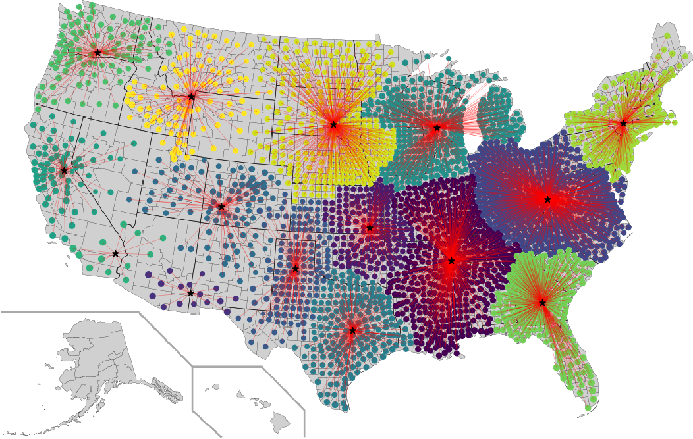
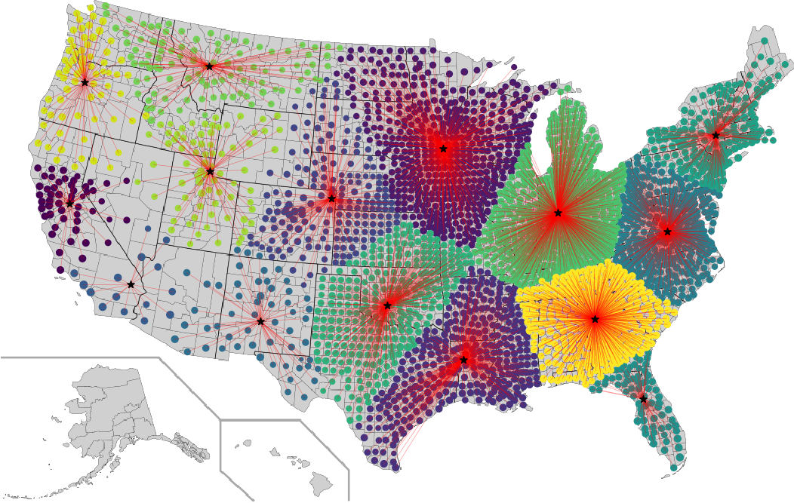
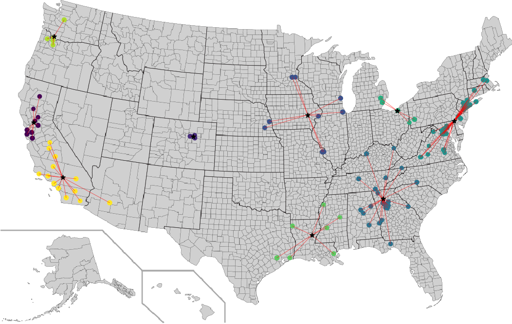
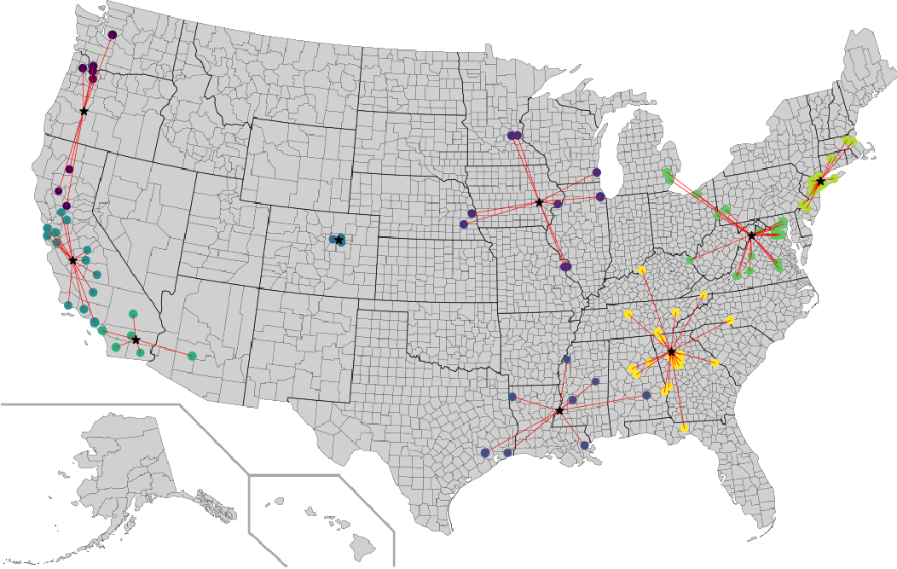
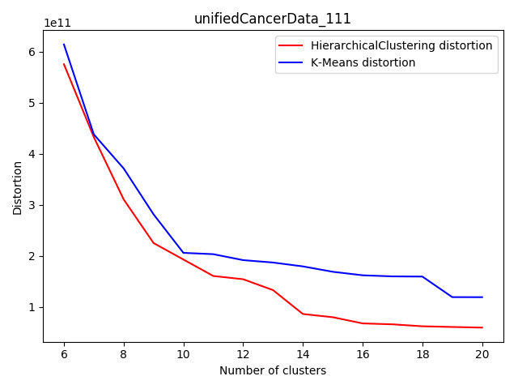
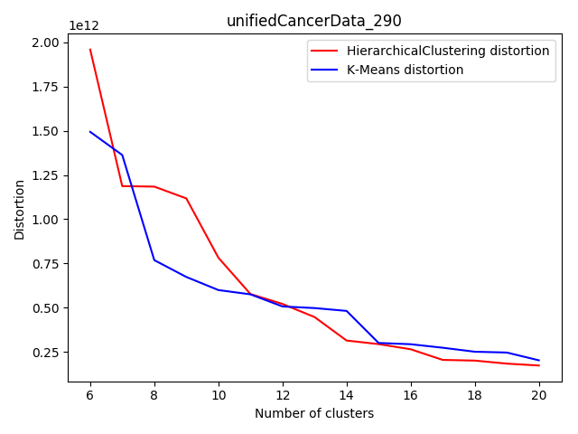
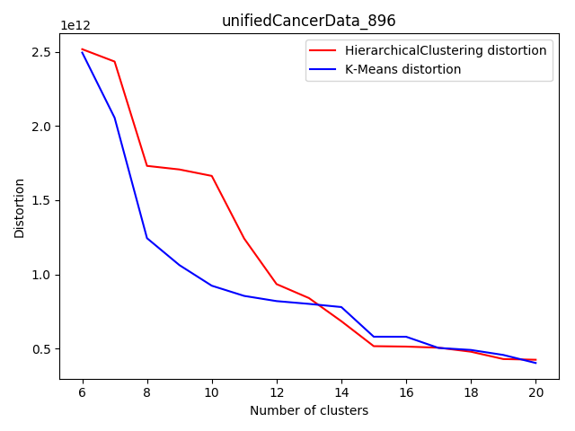

## -Efficienza dei metodi-
### Domanda (1) e (2)
#### HierarchicalClustering

#### K-MeansClustering

### Domanda (3)
#### - Complessità:
Consideriamo solo un piccola frazione dei punti n totali nel dataset ed assumiamo che l'algoritmo **HierarchicalClustering**
utilizzi solo **FastClosestPair**.
Quest'ultimo ha complessità **O(n log(n))** perciò l'algoritmo del clustering gerarchico avrà una complessità totale **O((n-k)(n log(n)))** dovendo produrre k cluster.
L'algoritmo di clustering **K-Means** invece, dovendo creare k cluster con al massimo q interazioni, ha una complessità dell'ordine **O(q n k)** .

#### - Tempi asintotici d'esecuzione:
Dal punto di vista dei tempi asintotici, assumendo che **K-Means** utilizzi sempre un numero piccolo di interazioni q, si può approssimare il tempo asintotico ad un'**esecuzione lineare** sul numero dei punti n. Per quanto riguarda l'algoritmo 
**HierarchicalClustering** invece, con k cluster, il numero di iterazioni che esso deve eseguire è _(n-k)_, ma si può approssimare ad n, con la precondizione di un k molto piccolo.
Di conseguenza il tempo asintotico totale di clustering gerarchico diventa **O(n^2(log(n)))** .

È facile concludere che il metodo di clustering più veloce, quando il numero dei cluster in output è molto piccolo, è sicuramente **K-Means**. 

## -Automazione dei metodi-
### Domanda (4) e (5)
#### HierarchicalClustering

#### K-MeansClustering

### Domanda (6)

| Algoritmo | Distorsione
|:---:|:---:|
| Hierarchical Clustering | 2.251 x 10^11 |
| K-means | 2.814 x 10^11|

### Domanda (7)

Osservando i cluster generati lungo la costa occidentale degli Stati Uniti, possiamo notare come la disposizione delle contee rispetto al centro del cluster sia differente: in quelli ottenuti con **HierarchicalClustering** i punti sono più raggruppati, portando ad una distorsione nettamente minore rispetto a quelli ottenuti con **K-MeansClustering** (almeno in 2 dei 3 cluster presi in esame). Tale diversità é da imputare alla diversa scelta eseguita durante l'inizializzazione, in particolare K-MeansClustering utilizza le contee più popolose come punto iniziale dei primi cluster, mentre HierarchicalClustering non dipende da questo parametro; il clustering gerarchico, invece, inizia raggruppando fra loro le contee più vicine.
Può quindi capitare che due contee molto popolose e vicine risultino in cluster separati utilizzano il secondo algoritmo, come si può ben vedere dal grafico generato.

### Domanda (8)

Possiamo affermare che, tra i due algoritmi di clustering in analisi, **K-MeansClustering** richiede sicuramente una maggiore supervisione umana. Questo poichè è necessario fare un calcolo a priori sul corretto numero q di iterazioni che permetta all'algoritmo di generare un insieme di cluster con una dispersione più bassa possibile. Sarebbe, però, possibile automatizzare tale procedura adottando un metodo di minimalizzazione su q, finché non si ottenga un valore minimo di distorsione. Al contrario **HierarchicalClustering** non ha bisogno di tale supervisione, visto che ottiene un risultato ottimale, ma con dei tempi d'esecuzione nettamente più elevati (come anche la sua complessità).

## -Qualità dei metodi-
### Domanda (9)

Possiamo notare come con l'aumentare del numero di cluster la distorsione diminuisca per entrambi gli algoritmi utilizzati,
inoltre i due algoritmi tendono a dare risulati sempre più vicini.

### Domanda (10)

